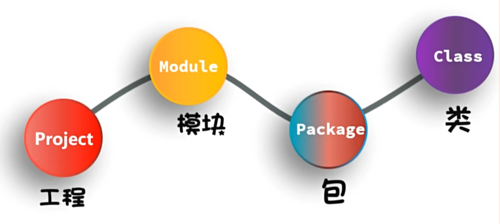
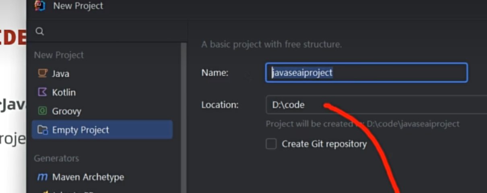
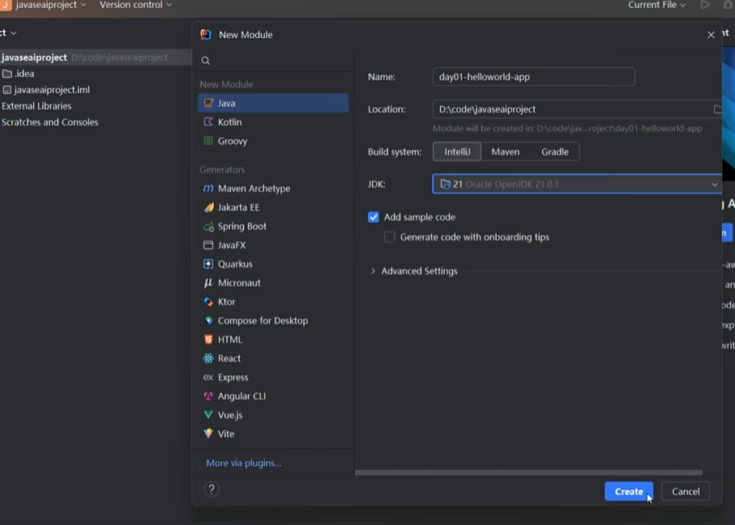
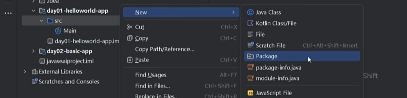
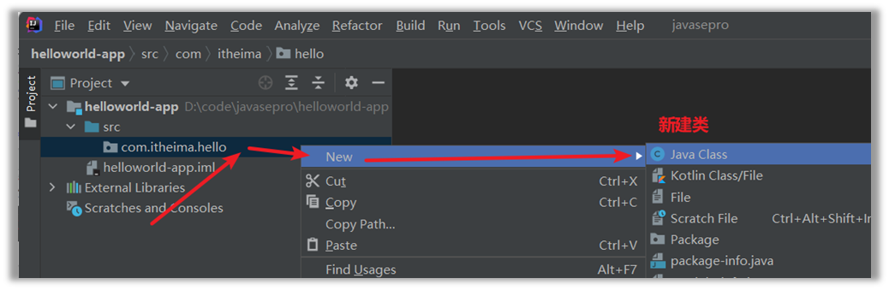
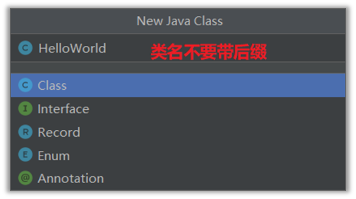
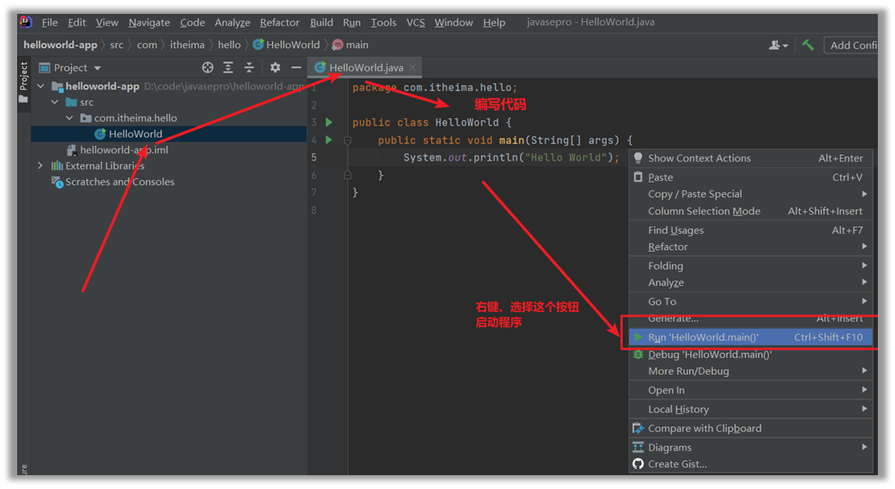

## java开发

### java程序开发步骤

1. 编写代码，文件名以.java结尾
2. 编译代码

```
D:\暑假项目\code>javac HelloWorld.java
```

3. 运行代码

``` 
D:\暑假项目\code>java HelloWorld
Hello World!
```
* 注意保存文件 Ctrl+C ，文件名称必须和代码中的类名称一致
* 建议代码文件命名全英文，首字母大写，满足驼峰模式，源代码文件后缀必须是.java

JAVA跨平台

一次编译，处处可用

### 代码结构
[]

### 使用IDEA开发第一个Java程序的步骤

1. 创建工程 new Project （空工程）
[]

2. 创建模块 new Module

3. 创建包 new Package


命名使用公司域名的倒写 com.XXXX.技术名

4. 创建类



5. 编写代码、并启动


### 常用快捷键

|快捷键|作用|
|----|----|
|main/psvm、sout....|快速键入相关代码|
|Ctrl + D|复制当前行数据到下一行|
|Ctrl + Y|删除所在行，建议用Ctrl + X|
|Ctrl + ALT + L|格式化代码|
|Ctrl + /，Ctrl + Shift + /|对代码进行注释|

修改类名称：Refactor  Rename

修改模块：Refactor  Rename  选Rename module and directory

导入模块：

1. 复制模块粘贴到工程
2. File  New  Model from Existing Sources...
3. 找到复制的模块，一直点下一步
4. 选择SDK

### Java基本

功能的最小单元：方法

#### 注释

注释是写在程序中对代码进行解释说明的文字，方便自己和别人查看，以便理解程序

1. 单行注释

//注释内容，只能写一行

2. 多行注释

/*
注释内容1

注释内容2
*/

3. 文档注释

/**
注释内容

注释内容，一般不写在程序内部，写在文档或程序上面
**/

* 注释不影响程序的执行

#### 字面量


#### 变量

变量就是内存中的一块区域，可以理解成一个盒子，用来装程序要处理的数据的。

定义格式：
数据类型（限制盒子中只能存储的某种数据形式）    变量名称（首字母建议小写，要有意义）    =（赋值）   数据;
int age =   18;

特点：
变量里装的数据是可以被替换的。

#### 数据类型

基本数据类型

|数据类型||内存占用|数据范围|
|----|----|----|----|
|整形|byte|1|-128~127|
||short|2|-32768~32767|
||int(默认)|4|-214783648~214783647|
||long|8|19位数|
|浮点型（小数）|float|4|1.401298E-45到3.4028235E+38|
||double（默认）|8|4.9000000E-324到1.797693E+308|
|字符型|char|2|0=65535|
|布尔型|boolean|1|true,false|


字符串类型：

String  str =   "Hello";

System.out.println(str)

同时要在main那里调用

#### 关键字

关键字是Java语言中预定义的、具有特殊含义的保留字，你不能将它们用作变量名、类名或其他标识符名称。

常见的Java关键字包括：

* 数据类型相关：int, double, boolean, char, String, void
* 控制流程相关：if, else, for, while, do, switch, case, break, continue, return
* 访问修饰符：public, private, protected
* 类和方法相关：class, interface, extends, implements, abstract, static, final
* 异常处理：try, catch, finally, throw, throws
* 其他：new, this, super, import, package

#### 标识符

标识符是程序员自己定义的名称，用于标识类、方法、变量、接口等元素。

标识符的命名规则：

1. 只能包含：字母（a-z, A-Z）、数字（0-9）、下划线（_）、美元符号（$）
2. 不能以数字开头
3. 区分大小写
4. 不能是关键字或保留字
5. 长度没有限制

* 变量名：使用小驼峰命名法，如 studentName, totalScore
* 类名：使用大驼峰命名法，如 StudentInfo, HelloWorld
* 常量名：全部大写，单词间用下划线分隔，如 MAX_VALUE, PI